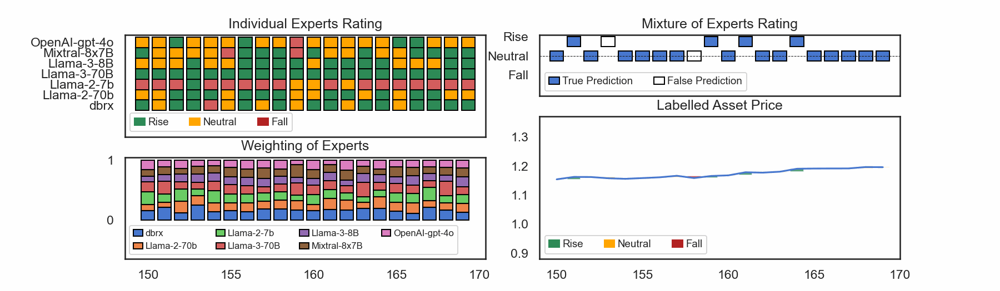
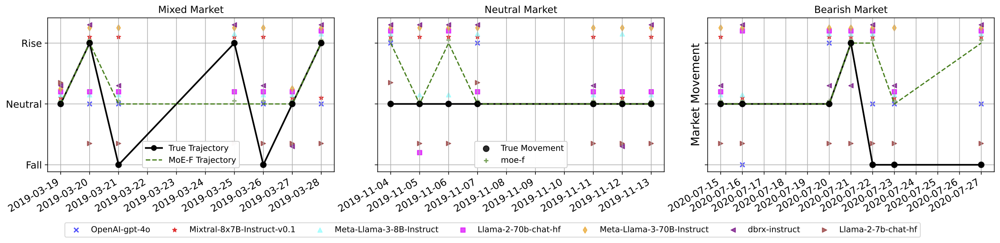
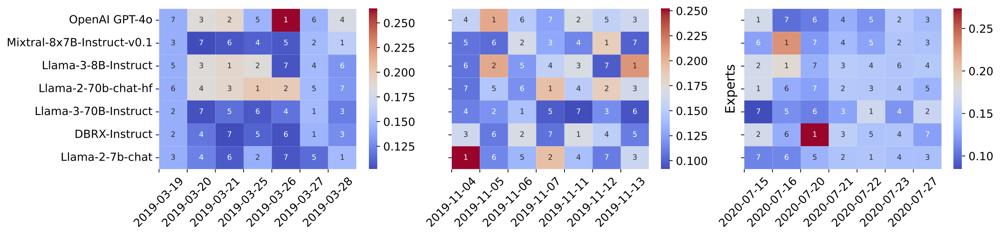
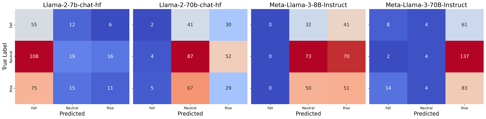
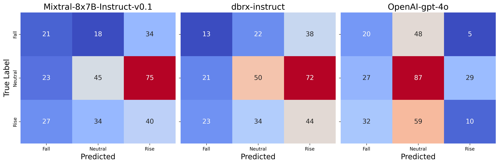

# Filtered not Mixed: Filtering-Based Online Gating for Mixture of Large Language Models 

This repository serves as the supplementary materials reposity for our proposed Mixture of Experts Filter (MoE-F) work published and presented at the ICLR 2025 [[OpenReview](https://openreview.net/pdf?id=ecIvumCyAj)].


## 📋 Table of Contents

- [🧠 Concept](#concept)
- [📌 Concrete Example](#concrete-example)
  - [Financial Market Movement Task](#fmm-task)
  - [Expert Weights Heatmap](#expert-weights-heatmap)
- [📊 Generating the Results Tables](#generating-the-results-tables)
- [📈 Experts Performance on NIFTY Test Split](#experts-performance-on-nifty-test-split)
- [📝 Citing](#-citing)
- [🙏 Acknowledgements](#-acknowledgements)


## 🧠 Concept <a name="concept"></a>
The following is a conceptual flow showing how MoE-F works: 


## 📌 Concrete Example <a name="concrete-example"></a>
### Financial Market Movement Task <a name="fmm-task"></a>

**Dataset** The NIFTY dataset for Financial News Headlines [paper](https://arxiv.org/abs/2405.09747) used for this section's experiments are available via [HuggingFace](https://huggingface.co/datasets/raeidsaqur/NIFTY). 

Examining a cross-sectional time-window snapshot allows a better understanding. 



### Expert Weights Heatmap <a name="expert-weights-heatmap"></a>
The below diagram depicts corresponding weighting ranks of the 7 experts corresponding to the 3 randomly sampled week-long trading windows with market mimicking different (bull, bear, neutral) regimes shown [above](#fmm-task). 




## 📊 Generating the Results Tables <a name="generating-the-results-tables"></a>

The [experiments](./MoE-F_supplementary.materials/experiments) folder contains all expert models' results in response 
to the [NIFTY-LM](https://huggingface.co/datasets/raeidsaqur/NIFTY)'s _test split_.


To generate the main results of the paper (in Table 2), run:
```bash
./generate_results.sh --model_name "OpenAI" --model_variant "gpt-4o" --seed 42 --average "weighted"
```
Using the `model_names` and `model_variants` as desired.

```angular2html
model_names = ["Llama-2", "Llama-2", "Meta-Llama-3", "Meta-Llama-3", "Mixtral-8x7B", "dbrx", "OpenAI"]
model_variants = ["7b-chat-hf", "70b-chat-hf", "8B-Instruct", "70B-Instruct", "Instruct-v0.1", "instruct", "gpt-4o"]
```


### 📈 Experts Performance on [NIFTY](https://arxiv.org/abs/2405.09747) Test Split <a name="experts-performance-on-nifty-test-split"></a>

**Llama-class models (Llama 2,3-[7B, 8B, 70B])**



**MoE models (Mixtral_7x8B, DBRX) and GPT4o**




## 📝 Citing

For scholastic references, please cite our paper as:

```
@article{saqur2024filtered,
      title={Filtered not Mixed: Stochastic Filtering-Based Online Gating for Mixture of Large Language Models}, 
      author={Raeid Saqur and Anastasis Kratsios and Florian Krach and Yannick Limmer and Jacob-Junqi Tian and John Willes and Blanka Horvath and Frank Rudzicz},
      year={2024},
      eprint={2406.02969},
      archivePrefix={arXiv},
      primaryClass={cs.LG},
      url={https://arxiv.org/abs/2406.02969}, 
}
```


## 🙏 Acknowledgements

Raeid Saqur (RS) is supported by Canada NSERC CGS-D Doctoral Grant. Anastasis Kratsios (AK) acknowledges financial support from an NSERC Discovery Grant No.\ RGPIN-2023-04482 and their McMaster Startup Funds. RS and AK acknowledge that resources used in preparing this research were provided, in part, by the Province of Ontario, the Government of Canada through CIFAR, and companies sponsoring the Vector Institute \href{https://vectorinstitute.ai/partnerships/current-partners/}{https://vectorinstitute.ai/partnerships/current-partners/}. The authors would also like to thank \href{https://vectorinstitute.ai/team/marshall-wang/}{Marshall Wang} for helping with reference code for computing DBRX experiments.


